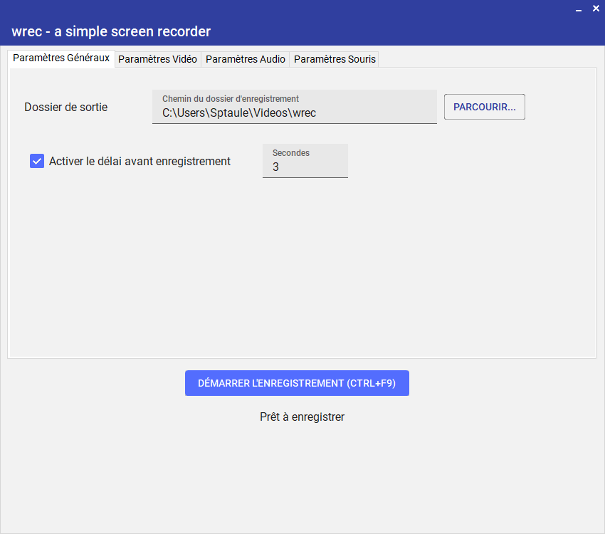
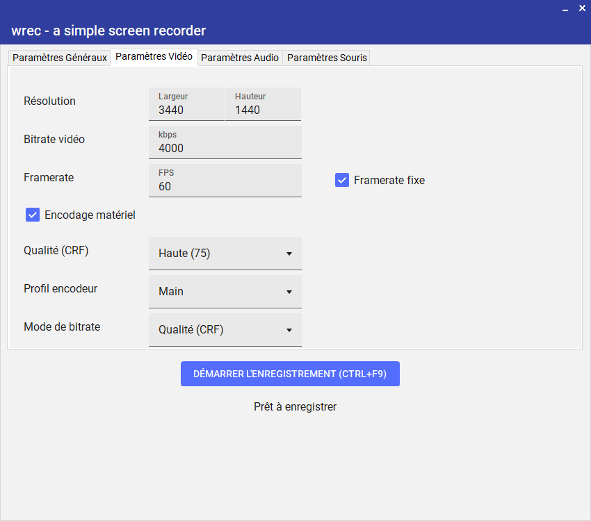
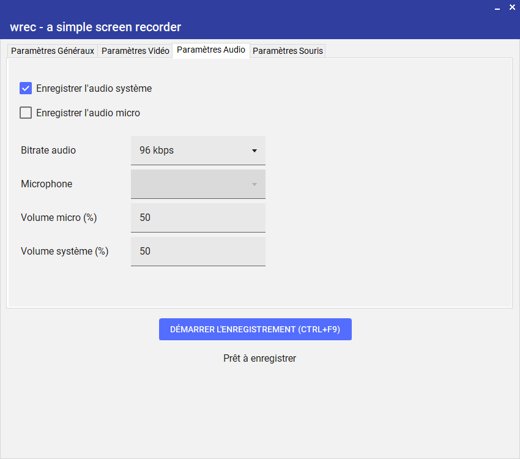
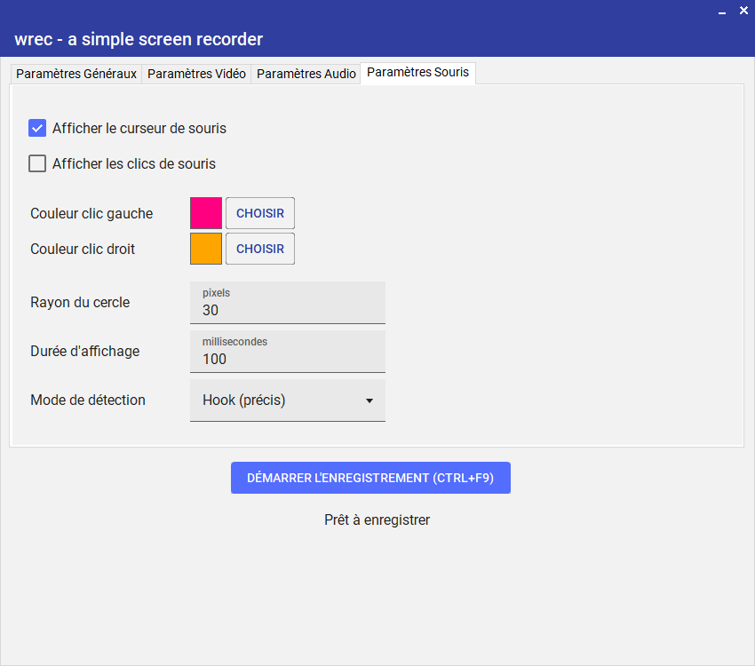
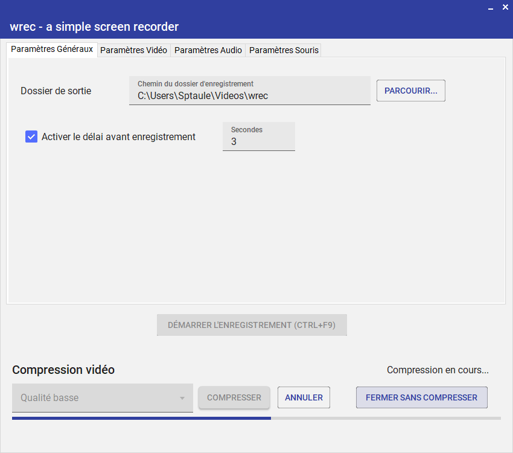

# wrec
un petit enregistreur d'écran pour Windows

### Fonctionnalités

- [x] 💻 Enregistre l'écran entier
- [x] Résolution paramétrable
- [x] Encodeur paramétrable (framerate, profil, bitrate, qualité)
- [x] 🎧 Enregistre l'audio système
- [x] 🎤️ Enregistre l'audio microphone
- [x] 🔊 Modification des volumes audio (système et micro)
- [x] Capture le curseur et les clics de souris (optionnel)
- [x] Paramétrage des clics de souris (couleurs, rayon, durée)
- [x] ⌛ Timer avant l'enregistrement (optionnel)
- [x] ⌨️ Raccourcis clavier pour démarrer/arrêter l'enregistrement (<kbd>Ctrl+F9</kbd> et <kbd>Ctrl+F10</kbd>)
- [x] ℹ️ Icône SystemTray lors de l'enregistrement
- [x] Compression disponible à la fin de l'enregistrement (ffmpeg)
- [x] Configuration sauvegardée à chaque changement

### Captures d'écran

|  |  |
|-----------------------------------|-----------------------------------|
|  |  |
|  |

### Librairies utilisées

- .NET ~ Windows Forms
- ScreenRecorderLib
- MaterialSkin2

### Compression

A la fin de l'enregistrement, la taille du fichier sera affichée.  
Vous pourrez alors choisir de compresser la vidéo si ffmpeg est disponible dans votre environnement.  

La détection et la sélection sera automatique pour l'encodeur en fonction de ce qui est disponible dans votre environnement (av1_nvenc, hevc_nvenc, h264_nvenc, libx265).  
Vous pourrez choisir le taux de compression.  
L'avancement de la compression est indiqué avec une jauge de progression.

### Conclusion

Il s'agit de mon premier programme C# donc des bugs peuvent être présents.  
Avant tout créé pour mon usage personnel, je souhaitais un programme simple permettant d'enregistrer mon écran entier avec audio système et micro.  
Je remercie grandement la librairie ScreenRecorderLib sans quoi ce programme n'aurait pas vu le jour.
